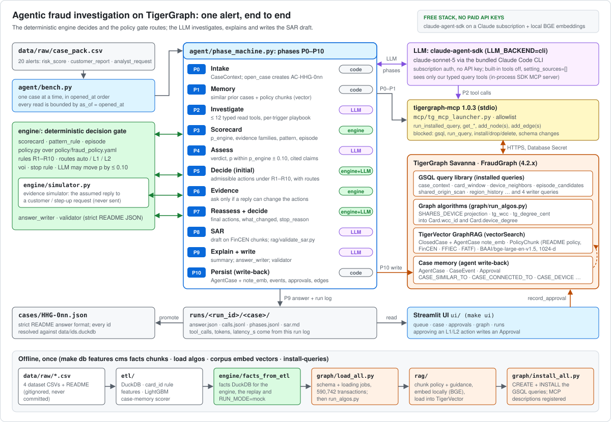

# Agentic Fraud Investigation on TigerGraph — Hacker House Goa 2026

An agent that takes an alert from the HHGOA case pack, investigates it through **TigerGraph** (GSQL query library + graph algorithms, exposed as **TigerGraph MCP** tools), grounds itself with **GraphRAG** over closed cases and FinCEN/FFIEC/FATF guidance (TigerVector), decides under the written **Fraud Policy** with a deterministic policy gate, asks for evidence when the policy says so, explains itself, and **writes its case back into the graph** so later investigations retrieve it. Streamlit UI with an approval inbox.

| Deliverable | Where |
|---|---|
| 20 answer files | [`cases/`](cases/) (`HHG-001.json` … `HHG-020.json`, [`cases/MANIFEST.md`](cases/MANIFEST.md)) |
| Demo video (3–5 min) | https://youtu.be/ukipV4v2PTk |
| Technical blog | [`docs/blog.md`](docs/blog.md) (published copy: [Medium](https://medium.com/@aryan.gupta./a-0-05-risk-score-on-a-device-shared-by-52-cards-building-a-fraud-agent-on-tigergraph-daab7335f3f7)) |
| Social post (tags @TigerGraphDB and @247pmstudio) | [x.com/aryangupta1411](https://x.com/aryangupta1411/status/2103366094375555120) |
| Architecture diagram | [`docs/architecture.svg`](docs/architecture.svg) |

## Judge quick-start (mock mode: no TigerGraph workspace, no API keys)

Everything below runs offline on a fresh clone. The dataset CSVs under `data/raw/` are not in the
repository (they are gitignored), so the checked-in `data/ids.duckdb` (id, transaction and closed-case tables for the validator) and
`data/hhgoa_engine.duckdb` (the engine's facts) stand in for the graph. You need
[uv](https://docs.astral.sh/uv/) and Python 3.12. Tested on macOS; CI runs the same steps on Ubuntu.

Clone the repository:

```bash
git clone https://github.com/aryangupta1411/Tiger-graph.git && cd Tiger-graph
```

Install the dependencies and create `.env` from `.env.example` (`RUN_MODE=mock`, no keys needed):

```bash
make install
```

Check the 20 submitted answer files against the README answer schema and the dataset ids:

```bash
make validate
```

Run one case end to end in mock mode (recorded model replies, DuckDB facts instead of the graph). The
one-row case pack fixture replaces `data/raw/case_pack.csv`; the answer lands in `runs/judge/HHG-014/answer.json`:

```bash
CASE_PACK_CSV=tests/fixtures/case_pack_HHG-014.csv uv run python -m agent.bench --cases HHG-014 --run-id judge --mock
```

Build a mock run from the 20 answer files so the dashboard has something to show:

```bash
make mock-run
```

Open the analyst dashboard at http://localhost:8501 and pick run `mock` in the sidebar:

```bash
RUN_MODE=mock make ui
```

The unit tests and the linter (data-backed tests skip without the full DuckDB):

```bash
make test lint
```

## Results

The files in `cases/` come from one clean live pass, run `live-final-2`, made with the ordered commands in
[`docs/RERUN.md`](docs/RERUN.md). Each case ran once against TigerGraph through MCP, on claude-sonnet-5 (high effort,
subscription backend). Before the pass, the earlier runs' graph write-backs were deleted and the fixed GSQL library
was reinstalled. [`cases/MANIFEST.md`](cases/MANIFEST.md) has the per-case verdict, probability, pattern, SAR, tool
calls, tokens and latency; the traces are in [`runs/live-final-2/`](runs/live-final-2/).

| Measure | Value |
|---|---|
| Verdicts | 8 fraud, 7 legitimate, 5 uncertain |
| SAR required | 2, HHG-006 (under-$500 burst) and HHG-014 (anonymous-proxy device ring), both `undocumented`; drafted, filing awaits L2 approval |
| Evidence requested | 14 of 20 cases (9 customer validation, 5 step-up; replies simulated and labelled `ASSUMED`) |
| Final actions by route | 46 auto, 18 L1, 2 L2 |
| Tool calls per case | median 19 (15-24); 0 failed |
| Tokens per case | median 286k (~95% prompt-cache writes and reads) |
| Time per case | median 151 s (121-264 s) |
| `make validate` | 20 clean, 0 problems |
| Written back to the graph | 20 `AgentCase`, 130 `CaseEvent`, 20 pending `Approval` |

All 20 answers agree with the engine's own offline prediction (`engine/out/<case>.draft.json`) on verdict, pattern,
episode transactions, exposure, SAR decision, status and both action sets with their routes, and on probability within
0.10. That is a self-consistency check, not accuracy: the organisers hold the answer key. Against real outcomes, a
replay of 310 labelled closed cases (`engine/out/replay_metrics.json`) scores, on the 180 confirmed-fraud ones,
pattern accuracy 0.878, SAR decision accuracy 0.939 and episode Jaccard 0.792, all below the targets of 0.95, 1.00 and
0.85. [`docs/blog.md`](docs/blog.md) walks through HHG-014 and the lessons.

## Architecture



```
case_pack.csv ─► agent/bench.py ─► agent/phase_machine.py (P0–P10; LLM = claude-agent-sdk, LLM_BACKEND=cli)
                                      │  16 typed read-only tools (14 GSQL query wrappers + 2 retrieval; 12 LLM calls/case) via
                                      │  mcp/tg_mcp_launcher.py → tigergraph-mcp 1.0.3 (stdio)  ──HTTPS──► Savanna TG-00 (4.2.x)
                                      ▼                                                                    FraudGraph + TigerVector
                        engine/ (scorecard · pattern · episode · SAR rule · policy gate · VoI · simulator)
                                      ▼
                        agent/persist (open_case / append_case_event / record_approval + add_edges via MCP; AgentCase + note_emb via pyTigerGraph)
                                      ▼
                  cases/HHG-0xx.json · runs/<run_id>/<case>/{calls,phases}.jsonl · ui/ (Streamlit)
offline once:  etl/ (DuckDB, card_id rule, baselines, LightGBM scorer) → engine/facts_from_etl.py → graph/load_all.py → graph/run_algos.py → rag/ (local embeddings) → graph/install_all.py
```

## Start here

Two commands answer "what can I run?" and "what is already built?". Both are instant, offline, and print
nothing but plain text when piped.

```bash
make help
```

Every target, grouped by build stage, with its description wrapped to your terminal width:

```
== make ============================================================================================
     agentic fraud investigation on TigerGraph - 39 targets, in build order

Start here
  help              this list, grouped by build stage (the default target)
  status            what exists and what does not: data, models, chunks, vectors, cases, backends.
                    Offline; never prints a secret

ETL, scorer, facts (day 1)
  db                data/raw/*.csv -> data/hhgoa.duckdb (tx 590,742 / idn 144,432 / cc 5,565 / cp
                    20; card rule 14,975/14,975)
  ...
```

```bash
make status
```

A dashboard of this checkout: which backends are selected, and which artefact each stage has
produced. It reads only the filesystem — no network, no TigerGraph, and secrets are reported as
`set` / `not set`, never printed.

```
artefact                    state    path                                detail
--------------------------  -------  ----------------------------------  ------
etl duckdb                  ready    data/hhgoa.duckdb                   356M
engine facts db             ready    data/hhgoa_engine.duckdb            50M
graph chunks                ready    data/out/txn_*.csv                  8 files, 324M
embeddings                  ready    data/out/vec_*.psv                  2 files, 53M
answer files                missing  cases/HHG-*.json                    -> make bench promote RUN_ID=v1

WARN 1 artefact(s) missing
     next: make bench promote RUN_ID=v1
```

Every command in this repository prints through one terminal layer (`ops/console.py`): a run header
with the config that decides the outcome, aligned tables instead of Python list reprs, and a summary
block with the totals. On a terminal it is coloured; piped, redirected or in CI it degrades to plain
ASCII with **zero escape bytes**, so `make sheet | cat` stays greppable. `NO_COLOR=1` and
`HHG_PLAIN=1` force plain (useful for a clean demo capture), `FORCE_COLOR=1` forces colour.

Mistyped or pasted a trailing `# comment` after a make command? Make no longer dies with
`No rule to make target '#'` — it names the closest real target, or tells you it was a pasted comment
and carries on.

## Setup (macOS Apple Silicon, Python 3.12 via uv)

```bash
git clone https://github.com/aryangupta1411/Tiger-graph.git && cd Tiger-graph
```

```bash
make install                 # uv sync --extra dev; creates .env from .env.example
```

```bash
# fill .env: TG_HOST, TG_SECRET (Savanna Database Secret)
# the model needs NO key: LLM_BACKEND=cli (the default) runs the agent on claude-agent-sdk, which drives
#   the Claude Code CLI it bundles and authenticates with your Claude subscription. It sees ONLY our typed
#   read queries (in-process SDK MCP server), no built-in tools, setting_sources=[] so your own settings
#   and CLAUDE.md never leak in. LLM_BACKEND=api switches back to the anthropic SDK and is the only case
#   that needs ANTHROPIC_API_KEY.
# embeddings need NO key: EMBED_BACKEND=local (the default) runs BAAI/bge-large-en-v1.5 (1024-d, MIT)
#   through sentence-transformers on this machine — one 1.34 GB download to ~/.cache/huggingface, then
#   no network. Lighter: EMBED_MODEL=BAAI/bge-small-en-v1.5 EMBED_DIM=384 (133 MB).
#   EMBED_BACKEND=voyage switches back to the paid Voyage API and is the only case that needs VOYAGE_API_KEY.
# put the four dataset CSVs and the dataset README under data/raw/  (transactions.csv identity.csv closed_cases_history.csv case_pack.csv README.md)
```

## Build the graph

Run `make status` between any two of these to see what the previous one produced.

DuckDB → features → scorer → engine facts DB → TSV chunks → `ids.duckdb` (day 1):

```bash
make db features cms facts chunks ids
```

Schema + loading jobs + 590,742 transactions; WCC / degree once (day 2, 4):

```bash
make load algos
```

The 25 installed queries (14 LLM-exposed reads + 4 writers + 7 harness-only: `grounding_chunks`, 4 RAG, `post_open_activity` and the UI's `case_subgraph`; the model sees 16 typed tools, the 14 plus `find_similar_cases` and `grounding_chunks`) and their MCP descriptions (day 3–4):

```bash
make install-queries describe
```

Deterministic engine: the expectation sheet (`qa/engine_expectation_sheet.md`) + 20 LLM-free drafts, printed as one aligned table of 20 cases with a summary of SARs filed and total exposure (day 5–6):

```bash
make sheet engine-drafts
```

GraphRAG corpus, local embeddings (no API key), TigerVector loads (day 7):

```bash
make corpus embed vectors
```

## Run the 20 cases

Wake the workspace (auto-resume drops the first request) — prints the TigerGraph version:

```bash
make awake
```

Optional: ping every 3 min while the benchmark runs, one `OK` line per ping:

```bash
make keepalive &
```

All 20 in `opened_at` order → `runs/v1/<case>/{answer.json,calls.jsonl,phases.jsonl,sar.md}`:

```bash
make bench RUN_ID=v1
```

Validator (ids resolved against `data/ids.duckdb`) → `cases/`:

```bash
make promote RUN_ID=v1
```

The analyst dashboard at http://localhost:8501 — queue · case · approvals · graph · runs:

```bash
make ui
```

Without a workspace or API keys, render the UI from `cases/` (or the sample HHG-014 answer) and replay recorded tool traces. `make mock-run` prints a table of every case it replayed, with the phase and call counts it synthesised:

```bash
RUN_MODE=mock make mock-run ui
```

Without a workspace but **with** the real model (subscription, still no keys) — the facts come from DuckDB, the decisions from Claude:

```bash
uv run python -m agent.bench --run-id cli1 --cases HHG-014,HHG-010 --mock --llm-backend cli
```

```bash
uv run python -m agent.validator --db data/ids.duckdb runs/cli1/*/answer.json
```

`--mock` picks the fact source (DuckDB instead of TigerGraph); `--llm-backend` picks the model
(`cli` = claude-agent-sdk, `api` = anthropic SDK, `mock` = recorded fixtures). They are independent.

## Checks that need nothing but this checkout

The unit suite (data-backed tests skip when the DuckDB files are absent):

```bash
make test
```

`ruff check .`:

```bash
make lint
```

Static GSQL lint — every `alias.attribute` in `graph/queries/*.gsql` resolves against `graph/schema.gsql`,
brackets balance, and `mcp/query_descriptions.yaml` has one entry per query. Prints a row per query file
and exits 1 on the first problem:

```bash
make lint-gsql
```

Contract lint — GSQL parameter lists vs `mcp/query_descriptions.yaml` vs `engine.facts_duckdb.DuckFacts`
vs `agent.mcp_client.BUILTIN_QUERIES`, as one coverage table (`ok` / `X` / `-` per module):

```bash
make lint-contracts
```

Rebuild the id-only validator DuckDB (`data/ids.duckdb`, checked in) and verify every row count:

```bash
make ids
```

## Deploy on Railway

The analyst dashboard runs on [Railway](https://railway.com) as one small container. The root `Dockerfile`
installs only what `ui/` imports: `requirements-ui.txt`, 70 packages pinned to `uv.lock`, about 127 MB of
wheels. A plain `uv sync` would download 3.4 GB, mostly torch and CUDA wheels. The image also ships `cases/` and
the canonical run `runs/live-final-2/`, so the public page shows all 20 cases with their full traces. It starts in
mock mode and read-only, so it needs no TigerGraph connection, no agent and no keys.

1. Commit and push the deploy files (`Dockerfile`, `.dockerignore`, `.railwayignore`, `railway.json`,
   `requirements-ui.txt`), the changes to `.gitignore` and `ui/`, and `runs/.gitkeep` with `runs/live-final-2/`.
   `.gitignore` now lets that one run in, and every other run stays local. Before pushing, check that
   `git ls-files runs/live-final-2 | wc -l` prints 82; without the run, the build fails at its `COPY`.
2. Sign in at railway.com with GitHub, then choose **New Project → Deploy from GitHub repo**, pick this repository
   and the branch `main`. If Railway asks, grant its GitHub app access to the repository. Railway finds the root
   `Dockerfile`, so leave **Custom Start Command** empty. If you do set one, wrap it so `$PORT` expands:
   `/bin/sh -c "exec streamlit run ui/app.py --server.address=0.0.0.0 --server.port=$PORT"`.
3. Under **Settings → Deploy**, set the healthcheck path to `/_stcore/health`. `railway.json` has the same settings,
   but Railway no longer reads config files for new services.
4. Under **Settings → Networking**, choose **Generate Domain**. The target port is the one Streamlit listens on,
   Railway's `PORT`.
5. No variables are required. Do not add `TG_SECRET` or API keys, and do not accept the variables Railway suggests
   from `.env.example`.

If the page stays on "Please wait...", set `STREAMLIT_BROWSER_SERVER_ADDRESS` to the service's `*.up.railway.app`
domain, so Streamlit accepts the browser's websocket origin. Keep CORS and XSRF protection on.

From a local checkout, `railway up` deploys the same image. It skips everything in `.gitignore` and
`.railwayignore`. Never pass `--no-gitignore`, because that uploads `.env`.

To try the image locally:

```bash
docker build -t hhgoa-ui . && docker run --rm -p 8501:8501 hhgoa-ui
```

| Variable | Image default | Effect |
|---|---|---|
| `RUN_MODE` | `mock` | Set to `live`, with `TG_HOST` and `TG_SECRET`, to make the graph page query `case_subgraph` on the workspace. |
| `DEPLOY_READONLY` | `1` | Investigate replays the recorded trace instead of running the agent, and approval decisions never reach the graph, even in live mode. |
| `APPROVALS_DB` | `/tmp/approvals.sqlite` | Path of the approval inbox, which every visitor shares. It must be an absolute, writable path: the relative `ui/approvals.sqlite` from `.env.example` breaks the Approvals page, because `/app` is read-only for the app user. A redeploy wipes the container disk. To keep decisions, attach a volume at `/data`, set this to `/data/approvals.sqlite` and set `RAILWAY_RUN_UID=0`, because the image runs as a non-root user. |
| `TG_HOST`, `TG_SECRET` | unset | Needed for live mode only. Add `TG_SECRET` as a sealed variable. On a public URL, any visitor who opens the graph page then wakes, and bills, the workspace, and connection errors show its hostname. |
| `PORT` | set by Railway | The port Streamlit listens on; `8501` when unset. |

## Guarantees about the answer files

- **Every id exists in the dataset.** The validator resolves every `TransactionID`, card id, customer id, `CC-` id and device-profile string against DuckDB before a file is promoted; an agent-written `AC-` id never appears in `entity_ids` (it is only in `graph_case_id`).
- `card_id` is derived by the rule that reproduces 100 % of the 14,975 labelled (transaction → card) pairs (`customer_id-K<dense_rank(card6)>`), tested in CI.
- Evidence is time-boxed to `ts <= opened_at`; post-open activity is a monitoring note, never in `affected_txn_ids` / `exposure_usd`.
- Routes and rules come from `policy/fraud_policy.yaml`; `auto` actions execute, `L1`/`L2` land in the approval inbox; `sar.file ⇔ FILE_REPORT ∈ final`; `verdict == fraud` ⇒ a block / decline / escalation in `final` and never `CLOSE_NO_FRAUD`; SAR narratives pass the single validator `rag/validate_sar.py`.
- Each case is written to the graph as `AgentCase AC-HHG-0nn` with `CaseEvent`s, `Approval`s and `CASE_SIMILAR_TO` edges; cases run in `opened_at` order so a later case can retrieve an earlier one (strictly `opened_at < as_of`, so never itself); in the final run none did, and every precedent was a closed case.
- `tool_calls`, `tokens`, `latency_s` come from the run log (`runs/<run_id>/<case>/calls.jsonl`); prompts are frozen and hashed into `run_manifest.json`.

## Repository map

`etl/` DuckDB + features + scorer (owns `data/out/*.csv` incl. `fraud_pattern.csv`) · `graph/` schema, loading jobs, 25 queries, algorithms, loaders · `mcp/` launcher, tool lists, query descriptions · `rag/` corpus, chunks, embeddings, vector loads, SAR generator + validator · `engine/` deterministic decision engine, facts DB builder, replay, drafts · `policy/` fraud_policy.yaml · `agent/` phase machine, prompts, schemas, MCP client, persist, validator, bench · `qa/` GSQL lint + cross-module contract lint · `ui/` Streamlit · `ops/` `console.py` (the one terminal-output layer every CLI prints through), ensure_awake, keep_alive, id export, mock runs · `docs/` checklists, demo script, blog · `tests/` unit + live.

## Data and licensing

IEEE-CIS Fraud Detection (Vesta) via the HHGOA re-cut. Only the HHGOA re-cut is used, and the answer validator (`engine/validator.py`) rejects any answer whose free text names an outside copy of the data or the outcome label (`isFraud`). Regulatory chunks carry url + sha256 + page provenance; full-text copies are vendored only for US-government guidance (FinCEN/FFIEC, public domain) — `python -m rag.fetch_corpus` re-downloads the copyrighted FATF report locally instead of shipping it in the repo.
